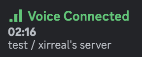
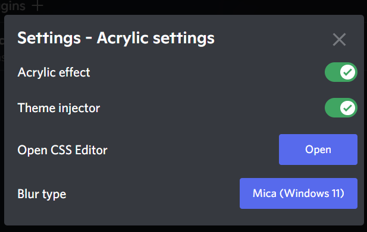

# Shelter plugins

This repo contains my [shelter](https://github.com/uwu/shelter/) plugins.

# How to install?

Paste the URL below into the add plugins modal in shelter. As shrimple as that.

> Mind the trailing `/`! It's still part of the URL, don't forget it.

# Install Button

Installation URL -> `https://shelter.xirreal.dev/installButton/`

[Source](https://github.com/xirreal-plugins/xirreal-plugins.github.io/tree/master/plugins/installButton)

# Hidden Channels

Shows hidden channels with a cute little red lock on them.\
_Updated: now using 100% ethically sourced SolidJS-React bridges!_

Installation URL -> `https://shelter.xirreal.dev/hiddenChannels/`

[Source](https://github.com/xirreal-plugins/xirreal-plugins.github.io/tree/master/plugins/hiddenChannels)

# VC Timer

Nifty little clock to show you how much time you wasted playing games this afternoon.

Installation URL -> `https://shelter.xirreal.dev/vcTimer/`

[Source](https://github.com/xirreal-plugins/xirreal-plugins.github.io/tree/master/plugins/vcTimer)

# Acrylic Settings

Manage your Acrylic settings easily, with a button to open the built in CSS editor.

Installation URL -> `https://shelter.xirreal.dev/acrylicSettings/`

[Source](https://github.com/xirreal-plugins/xirreal-plugins.github.io/tree/master/plugins/acrylicSettings)

# Template repo

Based on [Yellowsink's plugins repo](https://github.com/yellowsink/shelter-plugins/) and my old CC repo.
