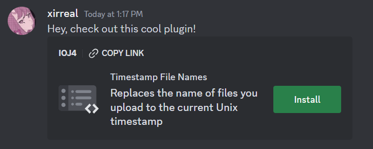
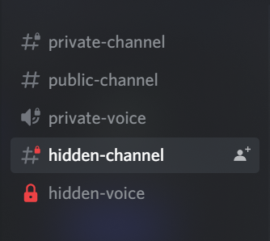

# Shelter plugins

This repo contains my [shelter](https://github.com/uwu/shelter/) plugins.

# How to install?

Paste the URL below into the add plugins modal in shelter. As shrimple as that.
If you wanna get even fancier, use the one click installers. (ok technically _two_ clicks because you need to confirm installation)

> Mind the trailing `/`! It's still part of the URL, don't forget it.

# Install Button

> **IMPORTANT**: _This plugin is required for the one click installers to work._

Manual installation URL: `https://shelter.xirreal.dev/installButton/`

[Source](https://github.com/xirreal-plugins/shelter-plugins/tree/master/plugins/installButton)

# Soundboard Hotkeys

### NEW!!!

Be extra annoying. Play sounds by pressing a button. Supports key combinations and works in the background.

Manual installation URL: `https://shelter.xirreal.dev/soundboardHotkeys/`

[Source](https://github.com/xirreal-plugins/shelter-plugins/tree/master/plugins/soundboardHotkeys)

# Hidden Channels

Shows hidden channels with a cute little red lock on them.\
_Updated: now using 100% ethically sourced SolidJS-React bridges!_

Manual installation URL: `https://shelter.xirreal.dev/hiddenChannels/`

[Source](https://github.com/xirreal-plugins/shelter-plugins/tree/master/plugins/hiddenChannels)

# Fweemojis

All the mojis!!! For free!!!

Manual installation URL: `https://shelter.xirreal.dev/fweemojis/`

[Source](https://github.com/xirreal-plugins/shelter-plugins/tree/master/plugins/fweemojis)

# VC Timer

Nifty little clock to show you how much time you wasted playing games today.

Manual installation URL: `https://shelter.xirreal.dev/vcTimer/`

[Source](https://github.com/xirreal-plugins/shelter-plugins/tree/master/plugins/vcTimer)

# Template repo

Based on [Yellowsink's plugins repo](https://github.com/yellowsink/shelter-plugins/) and my old CC repo.
